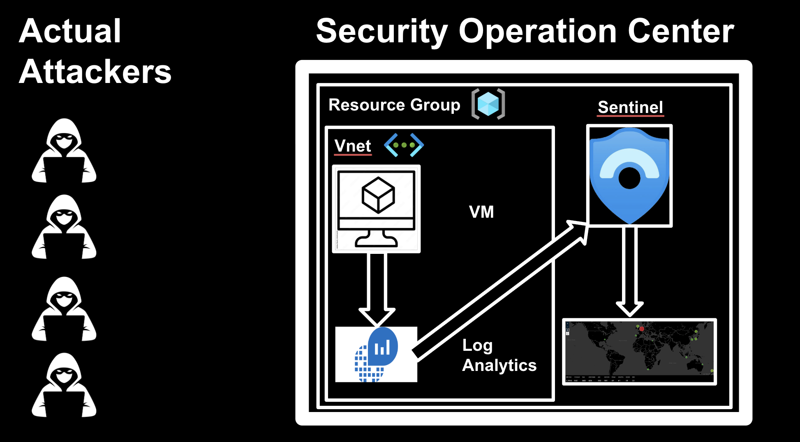
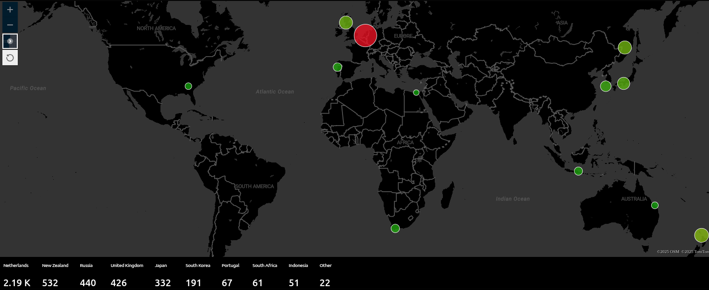

# SOC Attack Map Project

  

## Overview

This project demonstrates the end-to-end deployment and monitoring of a honeypot system in a cloud environment, leveraging Microsoft Azure and Sentinel SIEM. Within just a few hours of deploying the honeypot server, over 2,190 attack attempts were recorded, highlighting the prevalence and speed of automated attacks targeting exposed cloud resources. The project simulates real-world attack scenarios, collects and enriches security event data, and visualizes attack patterns geographically.

  

## Key Parts

- **Cloud Infrastructure Deployment:**
  - Provisioned a Windows 11 virtual machine (VM) in Azure to act as a honeypot, simulating a production endpoint.
  - Configured network security rules to allow inbound traffic, increasing the likelihood of attracting unauthorized access attempts.
  - Managed VM security settings, including firewall configuration, to facilitate controlled attack simulation.

- **Security Event Generation & Analysis:**
  - Simulated brute-force login attempts to generate authentic security events.
  - Utilized Windows Event Viewer to inspect and validate the occurrence of failed login events (Event ID 4625).

- **Centralized Log Management:**
  - Deployed an Azure Log Analytics Workspace (LAW) to aggregate security logs from the VM.
  - Integrated Azure Sentinel with LAW to enable advanced SIEM capabilities.
  - Configured the "Windows Security Events via AMA" connector for automated log forwarding.

- **Log Querying & Threat Hunting:**
  - Developed and executed Kusto Query Language (KQL) queries to identify and analyze failed login attempts and other security events.
  - Demonstrated proficiency in KQL, a critical skill for modern security operations.

- **Log Enrichment with Geolocation Data:**
  - Enhanced security event logs by correlating source IP addresses with geographic data using a custom watchlist (GeoIP database).
  - Automated the enrichment process to provide actionable context for incident response and threat analysis.

- **Attack Visualization:**
  - Built an interactive attack map using Azure Sentinel Workbooks.
  - Visualized the geographic origin of attack attempts in real time, providing clear insights into threat patterns and trends.

## Technical Skills Demonstrated
- Azure cloud resource provisioning and management
- Network security group (NSG) configuration
- Windows system administration and event log analysis
- SIEM setup and integration (Azure Sentinel)
- Log forwarding and centralized monitoring
- Kusto Query Language (KQL) for security analytics
- Data enrichment and correlation (GeoIP integration)
- Security data visualization (Sentinel Workbooks)
